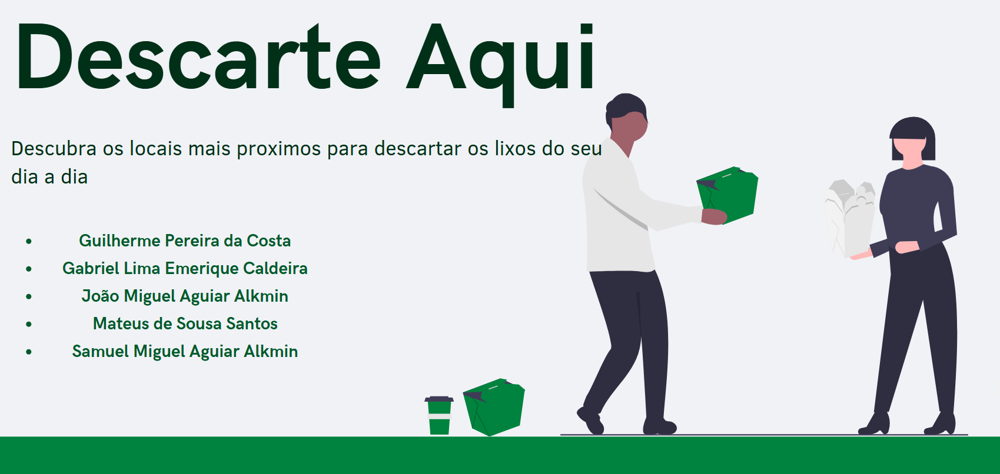

[](https://classroom.github.com/online_ide?assignment_repo_id=18966486&assignment_repo_type=AssignmentRepo)
# Descarte Aqui

Um site .org onde as pessoas poderam verificar os locais de coleta e descarte dos mais variados tipos de lixo que são assesiveis de suas casas.

## Alunos integrantes da equipe

* Mateus de Sousa Santos   
* Guilherme Pereira Da Costa
* Samuel Vieira
* João Miguel Aguiar Alkmin
* Gabriel Lima Emerique Caldeira

## Professores responsáveis

* Luciana Mara Freitas Diniz
* Hayala Nepomuceno Curto 
* Wesley Dias Maciel

## Instruções de utilização

```bash
    cd codigo
    npm run start
```


