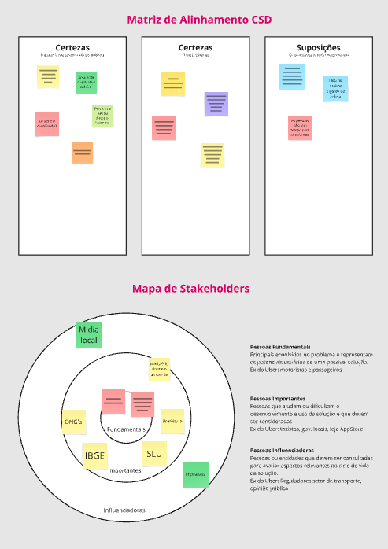
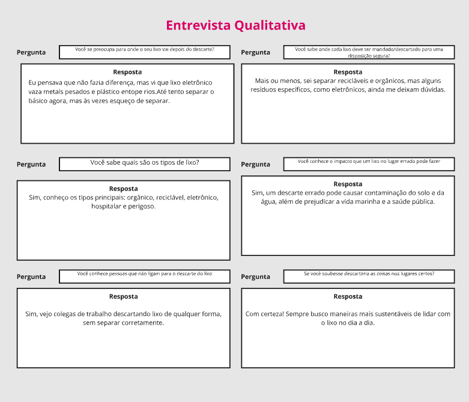
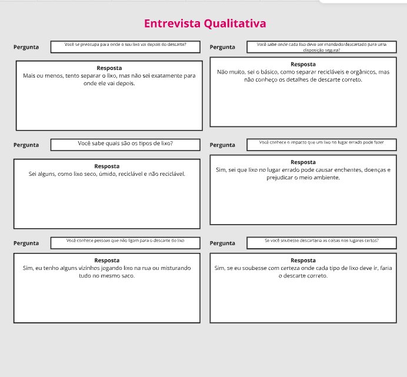
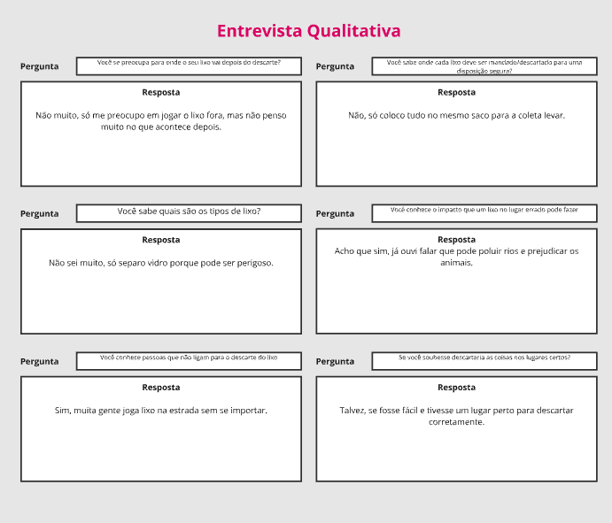
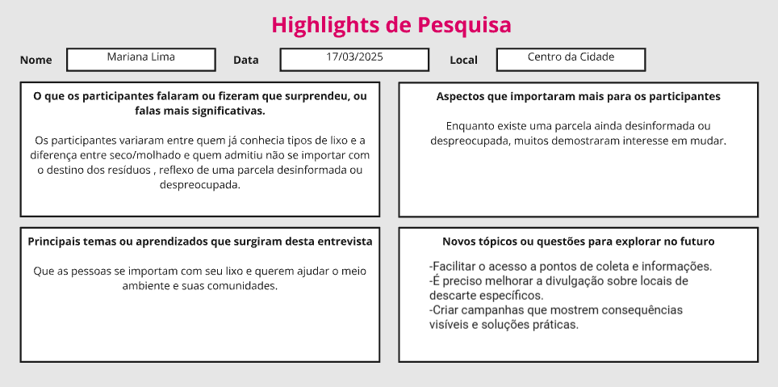
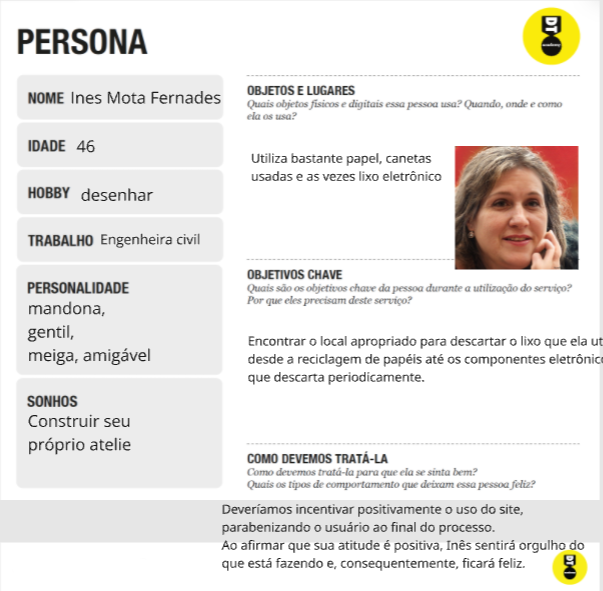
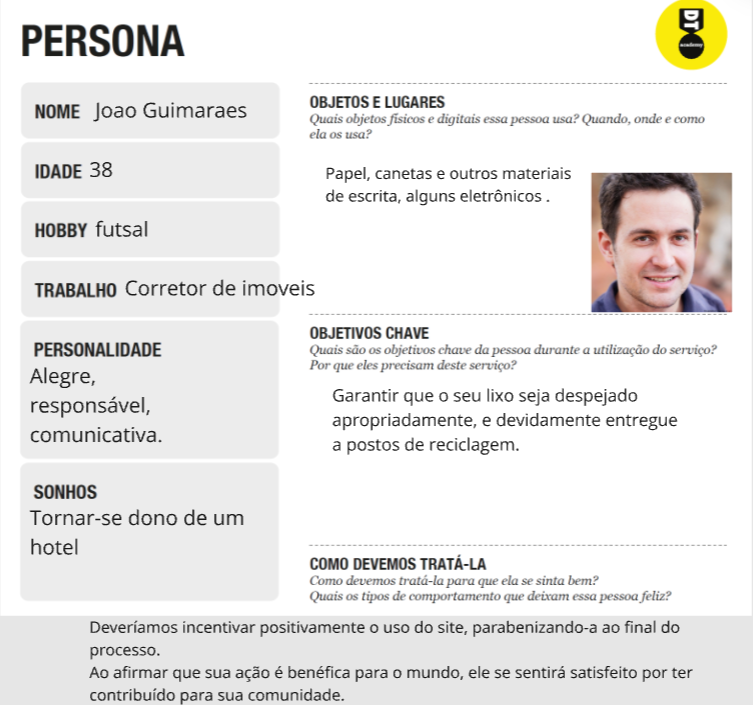
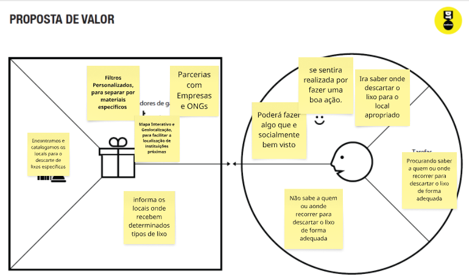
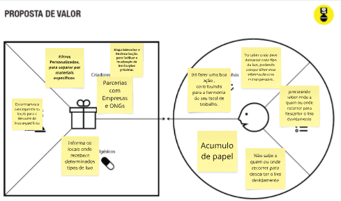

# Introdução

Um site .org onde as pessoas poderam verificar os locais de coleta e descarte dos mais variados tipos de lixo que são assesiveis de suas casas.


* **Projeto:** [Descarte Aqui]
* **Repositório GitHub:** [(https://github.com/ICEI-PUC-Minas-CC-TI/ti1-2025-1-t2-manha-descarteaqui.git)]
* **Membros da equipe:**

  * [Mateus de Sousa Santos](https://github.com/JomiAguiar)
  * [Guilherme Pereira Da Costa](https://github.com/Guilpc)
  * [Samuel Vieira](https://github.com/samuellucasrodrigues)
  * [João Miguel Aguiar Alkmin](https://github.com/JomiAguiar) 
  * [Gabriel Lima Emerique Caldeira](https://github.com/Caldeira-Byte) 

A documentação do projeto é estruturada da seguinte forma:

1. Introdução
2. Contexto
3. Product Discovery
4. Product Design
5. Metodologia
6. Solução
7. Referências Bibliográficas

✅ [Documentação de Design Thinking (MIRO)](files/processo-dt.pdf)

# Contexto

Detalhes sobre o espaço de problema, os objetivos do projeto, sua justificativa e público-alvo.

Muitas pessoas ainda têm dúvidas sobre onde e como descartar corretamente certos tipos de lixo, o que frequentemente leva ao descarte incorreto. Esse hábito causa poluição e contribui para o desperdício de materiais que poderiam ser reciclados. Um dos principais problemas é a falta de uma ferramenta simples e acessível que ajude a localizar pontos de coleta adequados para cada tipo de resíduo.


## Problema

Muitas pessoas não sabem onde ou como descartar certos tipos de lixo. O descarte incorreto causa poluição e desperdício de materiais.
Falta de uma ferramenta simples para achar os locais de coleta.

## Objetivos

Desenvolver um software que ofereça uma solução prática e eficiente para o problema do descarte incorreto de resíduos, facilitando o acesso a informações sobre os locais adequados para a coleta de diferentes tipos de lixo. A proposta visa contribuir para a redução da poluição e promover a conscientização ambiental por meio da tecnologia.

Objetivos Específicos:

Criar uma interface intuitiva e acessível que permita aos usuários localizar, por tipo de resíduo e localização geográfica, os pontos de coleta mais próximos.

Integrar ao software um banco de dados atualizado com informações sobre os tipos de resíduos, sua classificação e os locais disponíveis para descarte, priorizando usabilidade e abrangência de dados.

Promover a educação ambiental dentro da plataforma, com conteúdos informativos e dicas sobre reciclagem, reutilização e redução de lixo.

Esses objetivos permitirão aprofundar a prática investigativa tanto na parte técnica do desenvolvimento da aplicação quanto na análise do impacto social e ambiental que o software pode gerar.

## Justificativa

A escolha por desenvolver esta aplicação se deve à necessidade de facilitar o descarte correto de resíduos e reduzir os impactos ambientais causados pela falta de informação. Muitas pessoas não sabem onde ou como descartar certos materiais, o que contribui para a poluição e o desperdício de recursos recicláveis.

Os objetivos específicos foram definidos com foco na criação de uma plataforma prática e educativa, que ajude o usuário a localizar pontos de coleta e aprender sobre o descarte adequado. Para aprofundar o entendimento do problema, o grupo poderá aplicar questionários e entrevistas com a população e trabalhadores da área, além de analisar dados estatísticos sobre a geração e destinação de lixo.


## Público-Alvo

Nosso projeto tem como objetivo alcançar diferentes perfis de público que desejam contribuir para uma cidade mais limpa e sustentável. Entre eles, estão pessoas comuns preocupadas com o meio ambiente, empresários cujos empreendimentos geram grande volume de resíduos e buscam soluções adequadas para o descarte, além de pais e educadores interessados em ensinar às crianças a importância da separação e destinação correta do lixo. Ao reunir todos esses públicos, a aplicação busca promover a conscientização ambiental de forma acessível, prática e educativa.

# Product Discovery

## Etapa de Entendimento








## Etapa de Definição

### Personas





# Product Design

Nesse momento, vamos transformar os insights e validações obtidos em soluções tangíveis e utilizáveis. Essa fase envolve a definição de uma proposta de valor, detalhando a prioridade de cada ideia e a consequente criação de wireframes, mockups e protótipos de alta fidelidade, que detalham a interface e a experiência do usuário.

## Histórias de Usuários

Com base na análise das personas foram identificadas as seguintes histórias de usuários:

| EU COMO...`PERSONA` | QUERO/PRECISO ...`FUNCIONALIDADE`        | PARA ...`MOTIVO/VALOR`               |
| --------------------- | ------------------------------------------ | -------------------------------------- |
| Dona de casa   | Saber como separar o lixo e onde jogar cada tipo em seu devido lugar | Contribuir para a preservação do meio ambiente  |
| Ativista do meio ambiente        | Encontrar locais de coleta      | Contribuir na preservação do meio ambientes |
| Dono de um local de coleta          | Formas de promover meu negócio      |Ter mais pessoas descartando no meu local de coleta |
| Proprietário de um restaurante          | Local para descartar as sobras e os resíduos da cozinha       | Trazer uma boa reputação ao restaurante  |
| Vereador         | Descartar o lixo gerado pela cidade      | Melhorar  a cidade |
| Cidadão         | Mais locais de descarte      | Deixar a cidade mais limpa |
| Indústria Química        | Encontrar locais certos para descarte de lixo químico      | Evitar acidentes ambientais |
| Empresário        | Uma empresa sustentável que auxilie o meio ambiente      | Ajudar minha cidade  |

## Proposta de Valor

##### Proposta para Persona XPTO ⚠️ EXEMPLO ⚠️





## Requisitos

As tabelas que se seguem apresentam os requisitos funcionais e não funcionais que detalham o escopo do projeto.

### Requisitos Funcionais

| ID     | Descrição do Requisito                                   | Prioridade |
| ------ | ---------------------------------------------------------- | ---------- |
| RF-001 | Permitir que usuários busquem pontos de coleta | ALTA       |
| RF-002 | Filtrar pontos de coleta por tipo de material reciclável | ALTA    |
| RF-003 | Exibir detalhes de um ponto de coleta (endereço, materiais aceitos, etc) | ALTA    |
| RF-004 | Permitir que o usuário acesse conteúdos educativos sobre reciclagem | MÉDIA    |
| RF-005 | Permitir que o usuário cadastre pontos de coleta | MÉDIA    |


### Requisitos não Funcionais

| ID      | Descrição do Requisito                                                              | Prioridade |
| ------- | ------------------------------------------------------------------------------------- | ---------- |
| RNF-001 | O sistema deve ser responsivo para rodar em um dispositivos móvel  | MÉDIA     |
| RNF-002 | Deve processar requisições do usuário em no máximo 3 segundos      | MÉDIA     |
| RNF-003 | Em caso de falha, o sistema deve se recuperar automaticamente ou exibir mensagem clara de erro.| MÉDIA      |
| RNF-004 | Os dados dos usuários (como localização ou email, se coletados) devem ser protegidos por criptografia (HTTPS).| ALTA    |
| RNF-005 | O site deve seguir as diretrizes de acessibilidade WCAG 2.1 (por exemplo, contraste adequado, navegação por teclado).| ALTA    |
| RNF-005 | O código deve ser modular e documentado, permitindo fácil manutenção por outros desenvolvedores.| ALTA    |


## Projeto de Interface

Artefatos relacionados com a interface e a interacão do usuário na proposta de solução.

### Wireframes


#### TELA XPTO ⚠️ EXEMPLO ⚠️

Descrição para a tela XPTO


### User Flow

**✳️✳️✳️ COLOQUE AQUI O DIAGRAMA DE FLUXO DE TELAS ✳️✳️✳️**


> ⚠️ **APAGUE ESSA PARTE ANTES DE ENTREGAR SEU TRABALHO**
>
> Fluxo de usuário (User Flow) é uma técnica que permite ao desenvolvedor mapear todo fluxo de telas do site ou app. Essa técnica funciona para alinhar os caminhos e as possíveis ações que o usuário pode fazer junto com os membros de sua equipe.
>
> **Orientações**:
>
> - [User Flow: O Quê É e Como Fazer?](https://medium.com/7bits/fluxo-de-usu%C3%A1rio-user-flow-o-que-%C3%A9-como-fazer-79d965872534)
> - [User Flow vs Site Maps](http://designr.com.br/sitemap-e-user-flow-quais-as-diferencas-e-quando-usar-cada-um/)
> - [Top 25 User Flow Tools &amp; Templates for Smooth](https://www.mockplus.com/blog/post/user-flow-tools)

### Protótipo Interativo

**✳️✳️✳️ COLOQUE AQUI UM IFRAME COM SEU PROTÓTIPO INTERATIVO ✳️✳️✳️**

✅ [Protótipo Interativo (MarvelApp)](https://marvelapp.com/prototype/4hd6091?emb=1&iosapp=false&frameless=false)  ⚠️ EXEMPLO ⚠️

> ⚠️ **APAGUE ESSA PARTE ANTES DE ENTREGAR SEU TRABALHO**
>
> Um protótipo interativo apresenta o projeto de interfaces e permite ao usuário navegar pelas funcionalidades como se estivesse lidando com o software pronto. Utilize as mesmas ferramentas de construção de wireframes para montagem do seu protótipo interativo. Inclua o link para o protótipo interativo do projeto.

# Metodologia

Detalhes sobre a organização do grupo e o ferramental empregado.

## Ferramentas


Metodologias: Design Thinking e Scrum
Reuniões: Realizadas no Discord para discutir e planejar cada tarefa,
com  execução colaborativa.
Divisão de Papéis: Responsabilidades definidas entre os integrantes
do grupo para otimizar o desempenho.
Ferramentas:
Planejamento e Design: Miro, Canvas, Figma, HTML5, CSS e JS
Comunicação: Discord
Controle de Versão: Git

## Gerenciamento do Projeto

Divisão de papéis no grupo e apresentação da estrutura da ferramenta de controle de tarefas (Kanban).


> ⚠️ **APAGUE ESSA PARTE ANTES DE ENTREGAR SEU TRABALHO**
>
> Nesta parte do documento, você deve apresentar  o processo de trabalho baseado nas metodologias ágeis, a divisão de papéis e tarefas, as ferramentas empregadas e como foi realizada a gestão de configuração do projeto via GitHub.
>
> Coloque detalhes sobre o processo de Design Thinking e a implementação do Framework Scrum seguido pelo grupo. O grupo poderá fazer uso de ferramentas on-line para acompanhar o andamento do projeto, a execução das tarefas e o status de desenvolvimento da solução.
>
> **Orientações**:
>
> - [Sobre Projects - GitHub Docs](https://docs.github.com/pt/issues/planning-and-tracking-with-projects/learning-about-projects/about-projects)
> - [Gestão de projetos com GitHub | balta.io](https://balta.io/blog/gestao-de-projetos-com-github)
> - [(460) GitHub Projects - YouTube](https://www.youtube.com/playlist?list=PLiO7XHcmTsldZR93nkTFmmWbCEVF_8F5H)
> - [11 Passos Essenciais para Implantar Scrum no seu Projeto](https://mindmaster.com.br/scrum-11-passos/)
> - [Scrum em 9 minutos](https://www.youtube.com/watch?v=XfvQWnRgxG0)

# Solução Implementada

Esta seção apresenta todos os detalhes da solução criada no projeto.

## Vídeo do Projeto

O vídeo a seguir traz uma apresentação do problema que a equipe está tratando e a proposta de solução. ⚠️ EXEMPLO ⚠️

[](https://www.youtube.com/embed/70gGoFyGeqQ)

> ⚠️ **APAGUE ESSA PARTE ANTES DE ENTREGAR SEU TRABALHO**
>
> O video de apresentação é voltado para que o público externo possa conhecer a solução. O formato é livre, sendo importante que seja apresentado o problema e a solução numa linguagem descomplicada e direta.
>
> Inclua um link para o vídeo do projeto.

## Funcionalidades

Esta seção apresenta as funcionalidades da solução.Info

##### Funcionalidade 1 - Cadastro de Contatos ⚠️ EXEMPLO ⚠️

Permite a inclusão, leitura, alteração e exclusão de contatos para o sistema

* **Estrutura de dados:** [Contatos](#ti_ed_contatos)
* **Instruções de acesso:**
  * Abra o site e efetue o login
  * Acesse o menu principal e escolha a opção Cadastros
  * Em seguida, escolha a opção Contatos
* **Tela da funcionalidade**:


> ⚠️ **APAGUE ESSA PARTE ANTES DE ENTREGAR SEU TRABALHO**
>
> Apresente cada uma das funcionalidades que a aplicação fornece tanto para os usuários quanto aos administradores da solução.
>
> Inclua, para cada funcionalidade, itens como: (1) titulos e descrição da funcionalidade; (2) Estrutura de dados associada; (3) o detalhe sobre as instruções de acesso e uso.

## Estruturas de Dados

Descrição das estruturas de dados utilizadas na solução com exemplos no formato JSON.Info

##### Estrutura de Dados - Contatos   ⚠️ EXEMPLO ⚠️

Contatos da aplicação

```json
  {
    "id": 1,
    "nome": "Leanne Graham",
    "cidade": "Belo Horizonte",
    "categoria": "amigos",
    "email": "Sincere@april.biz",
    "telefone": "1-770-736-8031",
    "website": "hildegard.org"
  }
  
```

##### Estrutura de Dados - Usuários  ⚠️ EXEMPLO ⚠️

Registro dos usuários do sistema utilizados para login e para o perfil do sistema

```json
  {
    id: "eed55b91-45be-4f2c-81bc-7686135503f9",
    email: "admin@abc.com",
    id: "eed55b91-45be-4f2c-81bc-7686135503f9",
    login: "admin",
    nome: "Administrador do Sistema",
    senha: "123"
  }
```

> ⚠️ **APAGUE ESSA PARTE ANTES DE ENTREGAR SEU TRABALHO**
>
> Apresente as estruturas de dados utilizadas na solução tanto para dados utilizados na essência da aplicação quanto outras estruturas que foram criadas para algum tipo de configuração
>
> Nomeie a estrutura, coloque uma descrição sucinta e apresente um exemplo em formato JSON.
>
> **Orientações:**
>
> * [JSON Introduction](https://www.w3schools.com/js/js_json_intro.asp)
> * [Trabalhando com JSON - Aprendendo desenvolvimento web | MDN](https://developer.mozilla.org/pt-BR/docs/Learn/JavaScript/Objects/JSON)

## Módulos e APIs

Esta seção apresenta os módulos e APIs utilizados na solução

**Images**:

* Unsplash - [https://unsplash.com/](https://unsplash.com/) ⚠️ EXEMPLO ⚠️

**Fonts:**

* Icons Font Face - [https://fontawesome.com/](https://fontawesome.com/) ⚠️ EXEMPLO ⚠️

**Scripts:**

* jQuery - [http://www.jquery.com/](http://www.jquery.com/) ⚠️ EXEMPLO ⚠️
* Bootstrap 4 - [http://getbootstrap.com/](http://getbootstrap.com/) ⚠️ EXEMPLO ⚠️

> ⚠️ **APAGUE ESSA PARTE ANTES DE ENTREGAR SEU TRABALHO**
>
> Apresente os módulos e APIs utilizados no desenvolvimento da solução. Inclua itens como: (1) Frameworks, bibliotecas, módulos, etc. utilizados no desenvolvimento da solução; (2) APIs utilizadas para acesso a dados, serviços, etc.

# Referências

As referências utilizadas no trabalho foram:

* SOBRENOME, Nome do autor. Título da obra. 8. ed. Cidade: Editora, 2000. 287 p ⚠️ EXEMPLO ⚠️

> ⚠️ **APAGUE ESSA PARTE ANTES DE ENTREGAR SEU TRABALHO**
>
> Inclua todas as referências (livros, artigos, sites, etc) utilizados no desenvolvimento do trabalho.
>
> **Orientações**:
>
> - [Formato ABNT](https://www.normastecnicas.com/abnt/trabalhos-academicos/referencias/)
> - [Referências Bibliográficas da ABNT](https://comunidade.rockcontent.com/referencia-bibliografica-abnt/)
