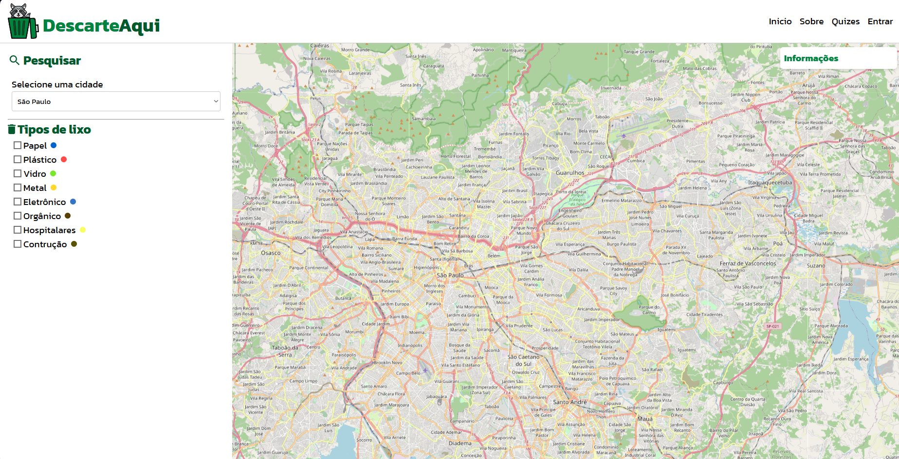
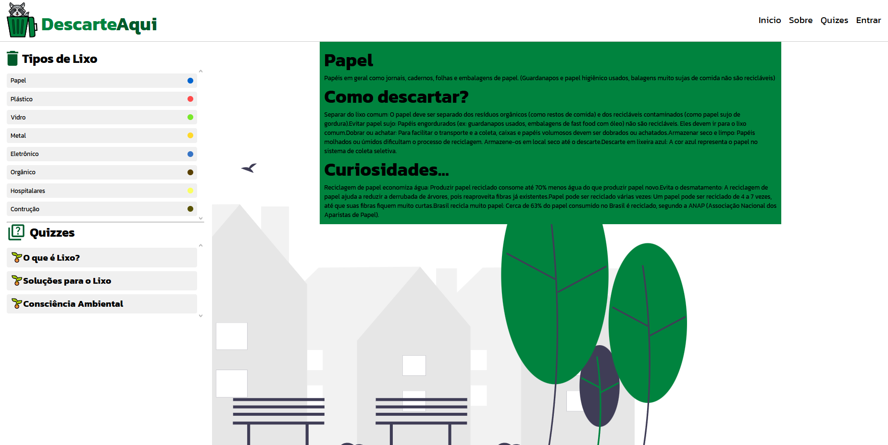
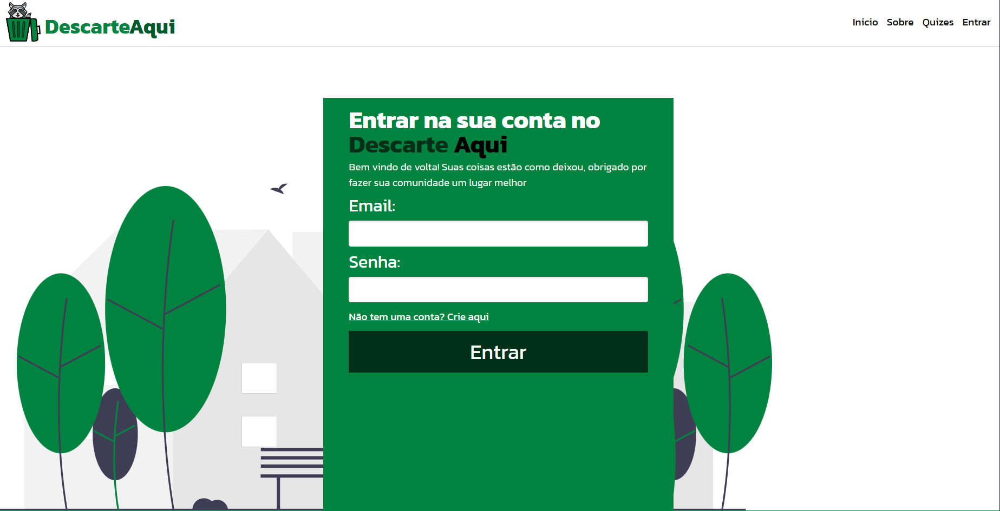
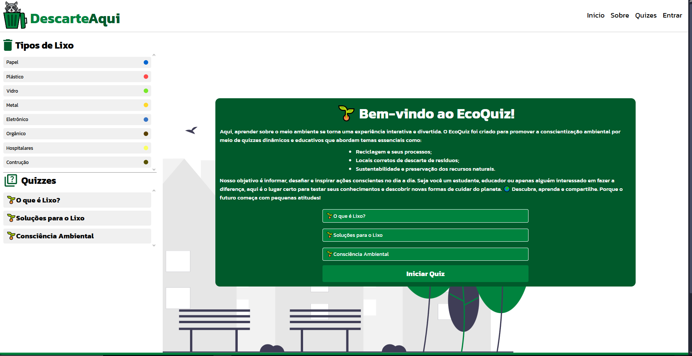
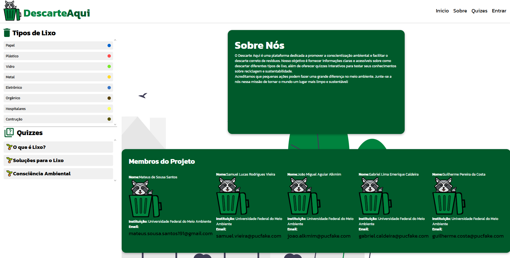

# Introdução

Um site .org onde as pessoas poderam verificar os locais de coleta e descarte dos mais variados tipos de lixo que são assesiveis de suas casas.


* **Projeto:** [Descarte Aqui]
* **Repositório GitHub:** [(https://github.com/ICEI-PUC-Minas-CC-TI/ti1-2025-1-t2-manha-descarteaqui.git)]
* **Membros da equipe:**

  * [Mateus de Sousa Santos](https://github.com/JomiAguiar)
  * [Guilherme Pereira Da Costa](https://github.com/Guilpc)
  * [Samuel Vieira](https://github.com/samuellucasrodrigues)
  * [João Miguel Aguiar Alkmin](https://github.com/JomiAguiar) 
  * [Gabriel Lima Emerique Caldeira](https://github.com/Caldeira-Byte) 

A documentação do projeto é estruturada da seguinte forma:

1. Introdução
2. Contexto
3. Product Discovery
4. Product Design
5. Metodologia
6. Solução
7. Referências Bibliográficas

✅ [Documentação de Design Thinking (MIRO)](files/processo-dt.pdf)

# Contexto

Detalhes sobre o espaço de problema, os objetivos do projeto, sua justificativa e público-alvo.

Muitas pessoas ainda têm dúvidas sobre onde e como descartar corretamente certos tipos de lixo, o que frequentemente leva ao descarte incorreto. Esse hábito causa poluição e contribui para o desperdício de materiais que poderiam ser reciclados. Um dos principais problemas é a falta de uma ferramenta simples e acessível que ajude a localizar pontos de coleta adequados para cada tipo de resíduo.


## Problema

Muitas pessoas não sabem onde ou como descartar certos tipos de lixo. O descarte incorreto causa poluição e desperdício de materiais.
Falta de uma ferramenta simples para achar os locais de coleta.

## Objetivos

Desenvolver um software que ofereça uma solução prática e eficiente para o problema do descarte incorreto de resíduos, facilitando o acesso a informações sobre os locais adequados para a coleta de diferentes tipos de lixo. A proposta visa contribuir para a redução da poluição e promover a conscientização ambiental por meio da tecnologia.

Objetivos Específicos:

Criar uma interface intuitiva e acessível que permita aos usuários localizar, por tipo de resíduo e localização geográfica, os pontos de coleta mais próximos.

Integrar ao software um banco de dados atualizado com informações sobre os tipos de resíduos, sua classificação e os locais disponíveis para descarte, priorizando usabilidade e abrangência de dados.

Promover a educação ambiental dentro da plataforma, com conteúdos informativos e dicas sobre reciclagem, reutilização e redução de lixo.

Esses objetivos permitirão aprofundar a prática investigativa tanto na parte técnica do desenvolvimento da aplicação quanto na análise do impacto social e ambiental que o software pode gerar.

## Justificativa

A escolha por desenvolver esta aplicação se deve à necessidade de facilitar o descarte correto de resíduos e reduzir os impactos ambientais causados pela falta de informação. Muitas pessoas não sabem onde ou como descartar certos materiais, o que contribui para a poluição e o desperdício de recursos recicláveis.

Os objetivos específicos foram definidos com foco na criação de uma plataforma prática e educativa, que ajude o usuário a localizar pontos de coleta e aprender sobre o descarte adequado. Para aprofundar o entendimento do problema, o grupo poderá aplicar questionários e entrevistas com a população e trabalhadores da área, além de analisar dados estatísticos sobre a geração e destinação de lixo.


## Público-Alvo

Nosso projeto tem como objetivo alcançar diferentes perfis de público que desejam contribuir para uma cidade mais limpa e sustentável. Entre eles, estão pessoas comuns preocupadas com o meio ambiente, empresários cujos empreendimentos geram grande volume de resíduos e buscam soluções adequadas para o descarte, além de pais e educadores interessados em ensinar às crianças a importância da separação e destinação correta do lixo. Ao reunir todos esses públicos, a aplicação busca promover a conscientização ambiental de forma acessível, prática e educativa.

# Product Discovery

## Etapa de Entendimento


## Etapa de Definição

### Personas


# Product Design

Nesse momento, vamos transformar os insights e validações obtidos em soluções tangíveis e utilizáveis. Essa fase envolve a definição de uma proposta de valor, detalhando a prioridade de cada ideia e a consequente criação de wireframes, mockups e protótipos de alta fidelidade, que detalham a interface e a experiência do usuário.

## Histórias de Usuários

Com base na análise das personas foram identificadas as seguintes histórias de usuários:

| EU COMO...`PERSONA` | QUERO/PRECISO ...`FUNCIONALIDADE`        | PARA ...`MOTIVO/VALOR`               |
| --------------------- | ------------------------------------------ | -------------------------------------- |
| Dona de casa   | Saber como separar o lixo e onde jogar cada tipo em seu devido lugar | Contribuir para a preservação do meio ambiente  |
| Ativista do meio ambiente        | Encontrar locais de coleta      | Contribuir na preservação do meio ambientes |
| Dono de um local de coleta          | Formas de promover meu negócio      |Ter mais pessoas descartando no meu local de coleta |
| Proprietário de um restaurante          | Local para descartar as sobras e os resíduos da cozinha       | Trazer uma boa reputação ao restaurante  |
| Vereador         | Descartar o lixo gerado pela cidade      | Melhorar  a cidade |
| Cidadão         | Mais locais de descarte      | Deixar a cidade mais limpa |
| Indústria Química        | Encontrar locais certos para descarte de lixo químico      | Evitar acidentes ambientais |
| Empresário        | Uma empresa sustentável que auxilie o meio ambiente      | Ajudar minha cidade  |

## Proposta de Valor

##### Proposta para Persona XPTO 


## Requisitos

As tabelas que se seguem apresentam os requisitos funcionais e não funcionais que detalham o escopo do projeto.

### Requisitos Funcionais

| ID     | Descrição do Requisito                                   | Prioridade |
| ------ | ---------------------------------------------------------- | ---------- |
| RF-001 | Permitir que usuários busquem pontos de coleta | ALTA       |
| RF-002 | Filtrar pontos de coleta por tipo de material reciclável | ALTA    |
| RF-003 | Exibir detalhes de um ponto de coleta (endereço, materiais aceitos, etc) | ALTA    |
| RF-004 | Permitir que o usuário acesse conteúdos educativos sobre reciclagem | MÉDIA    |
| RF-005 | Permitir que o usuário(adm) cadastre pontos de coleta | MÉDIA    |


### Requisitos não Funcionais

| ID      | Descrição do Requisito                                                              | Prioridade |
| ------- | ------------------------------------------------------------------------------------- | ---------- |
| RNF-001 | O sistema deve ser responsivo para rodar em um dispositivos móvel  | MÉDIA     |
| RNF-002 | Deve processar requisições do usuário em no máximo 3 segundos      | MÉDIA     |
| RNF-003 | Em caso de falha, o sistema deve se recuperar automaticamente ou exibir mensagem clara de erro.| MÉDIA      |
| RNF-004 | A interface deve ser intuitiva para usuários sem conhecimento técnico.| MÉDIA|
| RNF-005 | O site deve seguir as diretrizes de acessibilidade WCAG 2.1 (por exemplo, contraste adequado, navegação por teclado).| ALTA    |
| RNF-005 | O código deve ser modular e documentado, permitindo fácil manutenção por outros desenvolvedores.| ALTA    |


## Projeto de Interface

Artefatos relacionados com a interface e a interacão do usuário na proposta de solução.

### Wireframes


### User Flow


### Protótipo Interativo

# Metodologia

Detalhes sobre a organização do grupo e o ferramental empregado.

## Ferramentas

Metodologias: Design Thinking e Scrum
Reuniões: Realizadas no Discord para discutir e planejar cada tarefa,
com  execução colaborativa.
Divisão de Papéis: Responsabilidades definidas entre os integrantes
do grupo para otimizar o desempenho.
Ferramentas:
Planejamento e Design: Miro, Canvas, Figma, HTML5, CSS e JS
Comunicação: Discord
Controle de Versão: Git

## Gerenciamento do Projeto

Divisão de papéis no grupo e apresentação da estrutura da ferramenta de controle de tarefas (Kanban).

# Solução Implementada

Esta seção apresenta todos os detalhes da solução criada no projeto.

## Vídeo do Projeto

O vídeo a seguir traz uma apresentação do problema que a equipe está tratando e a proposta de solução. 

[](https://www.youtube.com/embed/70gGoFyGeqQ)

## Funcionalidades

Esta seção apresenta as funcionalidades da solução.Info

##### 🔹 Funcionalidade 1 – Página Principal com Mapa Interativo
Permite ao usuário visualizar os pontos de coleta disponíveis em sua cidade com base em sua localização ou pesquisa manual.

Estrutura de dados: Locais de Coleta

Instruções de acesso:

Acesse o site e vá para a página principal.

Use o mapa para explorar locais próximos.

Utilize a barra lateral para filtrar os pontos por tipo de lixo (reciclável, eletrônico, orgânico, etc.).

Use a barra de pesquisa para encontrar locais por nome, endereço ou tipo.

Tela da funcionalidade:

🔹 Funcionalidade 2 – Tipos de Lixo
Informa aos usuários os diferentes tipos de resíduos e orientações sobre o descarte correto.

Estrutura de dados: Tipos de Lixo

Instruções de acesso:

Clique na opção “Tipos de Lixo” no menu superior ou lateral.

Explore a lista com ícones, cores e descrições para entender como separar corretamente o lixo.

Tela da funcionalidade:

🔹 Funcionalidade 3 – Detalhes sobre o Local de Coleta
Exibe informações detalhadas de um ponto de coleta selecionado.

Estrutura de dados: Locais de Coleta

Instruções de acesso:

No mapa, clique sobre um ponto de coleta.

Uma página ou popup exibirá nome, endereço, tipos aceitos, horário de funcionamento e imagens.

Tela da funcionalidade:

🔹 Funcionalidade 4 – Login e Cadastro de Usuário
Permite ao usuário criar uma conta e acessar funcionalidades personalizadas, como comentários e favoritos.

Estrutura de dados: Usuários

Instruções de acesso:

Clique em “Entrar” no canto superior.

Faça login com email e senha ou crie uma nova conta.

Após o login, o sistema exibe o nome do usuário e permite interações adicionais.

Tela da funcionalidade:

🔹 Funcionalidade 5 – Comentários
Os usuários podem deixar comentários sobre os locais de coleta, avaliando a experiência.

Estrutura de dados: Comentários

Instruções de acesso:

Acesse os detalhes de um local de coleta.

Role até a seção de comentários.

Escreva e envie sua avaliação (é necessário estar logado).

Tela da funcionalidade:

🔹 Funcionalidade 6 – Quiz Educativo
Um jogo interativo para ensinar os usuários sobre o descarte correto dos resíduos.

Estrutura de dados: Quiz

Instruções de acesso:

Acesse o menu “Quiz”.

Responda perguntas sobre separação e descarte de lixo.

Ao final, veja sua pontuação e aprenda com as correções.

Tela da funcionalidade:
🔹 Funcionalidade 7 – Sobre Nós
Apresenta os integrantes do projeto com suas informações pessoais e descrição.

Estrutura de dados: sobre_nos

Instruções de acesso:

Acesse o menu “Sobre Nós”.

Veja a lista dos integrantes do projeto com nome, foto, descrição e e-mail.

Conheça quem está por trás do desenvolvimento da aplicação.

Tela da funcionalidade:

Exibe dinamicamente os dados dos integrantes usando o JSON para preencher fotos, nomes, descrições e contatos.


## Estruturas de Dados

## Tipos de Lixo (`tiposDeLixo`)

Representa os diferentes tipos de lixo, contendo informações sobre cor, descrição, descarte, curiosidades e imagem ilustrativa.

```json
{
  "tiposDeLixo": [
    {
      "id": "papel",
      "nome": "Papel",
      "cor": "#0064CF",
      "descricao": "Papéis em geral como jornais, cadernos, folhas e embalagens de papel. (Guardanapos e papel higiênico usados, embalagens muito sujas de comida não são recicláveis)",
      "descarte": "Separar do lixo comum: O papel deve ser separado dos resíduos orgânicos (como restos de comida) e dos recicláveis contaminados (como papel sujo de gordura). Evitar papel sujo: Papéis engordurados (ex: guardanapos usados, embalagens de fast food com óleo) não são recicláveis. Eles devem ir para o lixo comum. Dobrar ou achatar: Para facilitar o transporte e a coleta, caixas e papéis volumosos devem ser dobrados ou achatados. Armazenar seco e limpo: Papéis molhados ou úmidos dificultam o processo de reciclagem. Armazene-os em local seco até o descarte. Descarte em lixeira azul: A cor azul representa o papel no sistema de coleta seletiva.",
      "curiosidades": "Reciclagem de papel economiza água: Produzir papel reciclado consome até 70% menos água do que produzir papel novo. Evita o desmatamento: A reciclagem de papel ajuda a reduzir a derrubada de árvores, pois reaproveita fibras já existentes. Papel pode ser reciclado várias vezes: Um papel pode ser reciclado de 4 a 7 vezes, até que suas fibras fiquem muito curtas. Brasil recicla muito papel: Cerca de 63% do papel consumido no Brasil é reciclado, segundo a ANAP (Associação Nacional dos Aparistas de Papel).",
      "imagem": "https://portalresiduossolidos.com/category/tratamento-de-residuos/reciclagem-de-papel/"
    }
  ]
}
```

---

## Cidades (`cidades`)

Contém as cidades cadastradas, com suas identificações e coordenadas geográficas.

```json
{
  "cidades": [
    {
      "id": "sao_paulo",
      "nome": "São Paulo",
      "latitude": -23.5500,
      "longitude": -46.6333
    }
  ]
}
```

---

## Usuários (`usuarios`)

Lista de usuários do sistema, com dados para login e perfil.

```json
{
  "usuarios": [
    {
      "id": "user-001",
      "nome": "Ana",
      "email": "ana0@outlook.com",
      "senha": "w9x52d",
      "user_img": "/assets/images/male-avatar.svg"
    },
    {
      "id": "eed55b91-45be-4f2c-81bc-7686135503f9",
      "login": "admin",
      "nome": "Administrador do Sistema",
      "email": "admin@abc.com",
      "senha": "123"
    }
  ]
}
```

---

## Sobre Nós (`sobre_nos`)

Informações sobre integrantes da equipe ou pessoas relacionadas ao projeto.

```json
{
  "sobre_nos": [
    {
      "id": "sobre-001",
      "nome": "Mateus de Sousa Santos",
      "foto": "/assets/images/male-avatar.svg",
      "descricao": "Estudante da PUC com interesse em tecnologia e meio ambiente.",
      "email": "mateus.sousa.santos191@gmail.com"
    }
  ]
}
```

---

## Quiz (`quizes`)

Questionários compostos por perguntas e respostas, com indicação da resposta correta.

```json
{
  "quizes": [
    {
      "id": 1,
      "nome": "🌱O que é Lixo?",
      "descricao": "Lixo é tudo aquilo que não tem mais utilidade para o ser humano, mas que pode ser reaproveitado por outros seres vivos ou pela natureza.",
      "perguntas": [
        {
          "id": 1,
          "texto": "O que é lixo?",
          "respostas": [
            { "id": 1, "texto": "Tudo que não tem mais utilidade para o ser humano" },
            { "id": 2, "texto": "Tudo que é produzido pelo ser humano" },
            { "id": 3, "texto": "Tudo que é orgânico" },
            { "id": 4, "texto": "Tudo que é reciclável" }
          ],
          "resposta_correta_id": 1
        }
      ]
    }
  ]
}
```

---

## Locais e Comentários (`locais`)

Informações de locais para descarte e comentários dos usuários.

```json
{
  "locais": [
    {
      "id": "ChIJy2LC53eXpgAR4Z_Mb1vo5tw",
      "name": "DISK DESCARTE",
      "address": "R. Bueno do Prado, 72 - João Pinheiro, Belo Horizonte - MG, 30530-430, Brazil",
      "latitude": -19.9299167,
      "longitude": -43.99340110000001,
      "googleMapsUri": "https://maps.google.com/?cid=15917665412402946017",
      "phone": "(31) 98212-7894",
      "rating": 5,
      "comentarios": [
        {
          "comentario": "Poderia ter mais opções de descarte.",
          "data": "2025-05-21T22:29:55.645Z",
          "user": {
            "nome": "Ana",
            "email": "ana7@example.com",
            "user_img": "/assets/images/female-avatar.svg"
          }
        }
      ]
    }
  ]
}
```


## Módulos e APIs

Esta seção apresenta os módulos e APIs utilizados na solução

**Images**:

* unDraw - [https://undraw.co/illustrations]([https://unsplash.com/](https://undraw.co/illustrations)) ⚠️ EXEMPLO ⚠️

**Fonts:**

* Googe Fonts - [https://fonts.google.com/](https://fonts.google.com/)

**Scripts:**

* Leaflet - [http://www.jquery.com/](http://www.jquery.com/](https://leafletjs.com/)


